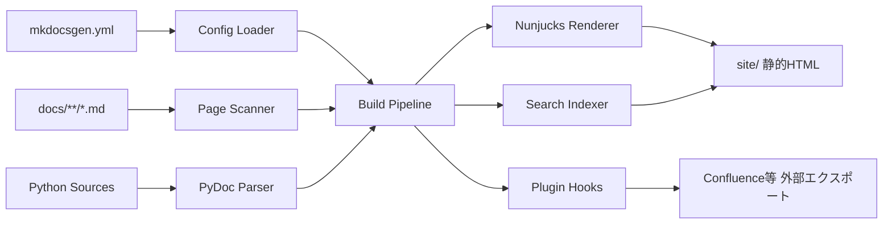

# MkDocsGen 仕様書（コンセプトプラン）

## 1. 概要

### 1.1 目的

Markdownファイル群から静的なドキュメントサイト（HTML）を生成するドキュメントビルダー「MkDocsGen」を開発する。
Sphinxのようにファイルツリーを基点としたページ階層構築、テーマの拡張・編集、Pythonソースコードからの
APIドキュメント自動生成、プラグインによる外部サービス（Confluence等）へのエクスポートを実現する。

### 1.2 対象ユーザー

- 開発者本人および社内プロジェクトのメンバー（当面は汎用OSSとしての公開は想定しない）
- Markdownでドキュメントを書ける開発者・技術者

### 1.3 背景

- 既存ツール（MkDocs / Sphinx）はPythonエコシステムに依存しており、Node.js中心のプロジェクトでは導入の摩擦がある
- Pythonコードのdocstring解析とMarkdownドキュメントを1つの階層に統合したい
- 社内向けにConfluence等へのエクスポート経路をプラグインで拡張できる仕組みが欲しい

### 1.4 基本方針（確定事項サマリ）

| 項目 | 決定内容 |
| --- | --- |
| 実装言語 | TypeScript / Node.js（Node.js 20以上） |
| 配布形態 | 社内・自分用（npm公開は当面しない、リポジトリ直接利用） |
| 設定ファイル | YAML（`mkdocsgen.yml`） |
| ページ階層 | ファイルツリーから自動構築 + 設定ファイルで上書き可能 |
| Markdown拡張 | GFM + Admonition + Mermaid |
| シンタックスハイライト | ビルド時に静的HTML化（Shiki） |
| Mermaid | クライアントサイドJSで描画 |
| Python解析 | TypeScriptによる静的解析（tree-sitter-python）、Googleスタイルdocstring |
| API連結 | Markdown内ディレクティブ（`::: pydoc`）方式 |
| テンプレート | Nunjucks（部分オーバーライド可能） |
| テーマ切替 | ライト/ダーク。システム追従 + 手動切替、localStorage保存 |
| プラグイン | ローカルJS/TSファイルのみ（ライフサイクルフック方式） |
| CLI | `init` / `build` / `serve`、クライアントサイド全文検索付き |
| リンク検証 | ビルド時に内部リンク切れをチェック |

## 2. 機能仕様

### 2.1 機能概要

MkDocsGenは以下のコンポーネントで構成されるCLIツールである。



- **Config Loader**: `mkdocsgen.yml` を読み込み・バリデーションし、正規化された設定オブジェクトを生成する
- **Page Scanner**: ドキュメントルート配下の `.md` ファイルを走査し、ファイルツリーからナビゲーションツリーを構築する
- **PyDoc Parser**: Pythonソースをtree-sitterで静的解析し、モジュール/クラス/関数のシグネチャとGoogleスタイルdocstringを構造化データに変換する
- **Build Pipeline**: Markdown変換（GFM/Admonition/ディレクティブ展開/Shikiハイライト）を行い、各ページのHTML断片を生成する
- **Nunjucks Renderer**: テーマテンプレートにページコンテンツとナビゲーション情報を流し込み、最終HTMLを出力する
- **Search Indexer**: 全ページのテキストから検索インデックスJSONを生成する
- **Plugin Hooks**: ビルドライフサイクルの各時点でローカルプラグインを呼び出す

### 2.2 CLIコマンド仕様

#### 2.2.1 `mkdocsgen init`

- カレントディレクトリに以下の雛形を生成する
  - `mkdocsgen.yml`（コメント付きのサンプル設定）
  - `docs/index.md`（トップページのサンプル）
  - `docs/guide/getting-started.md`（階層構造のサンプル）
- 既存ファイルがある場合は上書きせず、警告を出してスキップする

#### 2.2.2 `mkdocsgen build`

- `mkdocsgen.yml` を読み込み、`site/`（設定で変更可能）に静的サイトを出力する
- オプション:
  - `--config <path>`: 設定ファイルパスの指定（デフォルト: `./mkdocsgen.yml`）
  - `--strict`: 警告（リンク切れ等）をエラーとして扱い、終了コード1で失敗させる
  - `--clean`: 出力ディレクトリを事前に空にする
- 終了コード: 成功 0 / エラー 1

#### 2.2.3 `mkdocsgen serve`

- 開発用HTTPサーバーを起動する（デフォルト: `http://localhost:3000`、`--port` で変更可能）
- `docs/`、`mkdocsgen.yml`、テーマオーバーライドディレクトリ、pydoc対象のPythonソースを監視（chokidar）し、
  変更時に増分再ビルド + WebSocket経由でブラウザを自動リロードする
- 設定ファイル変更時はフルビルドを行う
- ビルドエラー発生時はプロセスを落とさず、ブラウザ上にエラーオーバーレイを表示する

### 2.3 ページ階層（ナビゲーション）構築

#### 2.3.1 自動構築ルール（デフォルト）

- ドキュメントルート（デフォルト: `docs/`）配下のディレクトリ構造をそのままナビゲーション階層とする
- 各ディレクトリの `index.md` はそのセクションのトップページとなる
- ページタイトルの決定優先順位:
  1. Markdownフロントマターの `title`
  2. ドキュメント先頭の `# 見出し`
  3. ファイル名（`getting-started.md` → `getting-started`）
- セクション名の決定優先順位:
  1. `index.md` のフロントマター `title`
  2. ディレクトリ名
- 並び順の決定優先順位:
  1. フロントマターの `order`（数値、昇順）
  2. ファイル名の辞書順（`index.md` は常に先頭）
- フロントマター `draft: true` のページはビルド対象から除外する（`serve` 時のみ表示するオプションは将来拡張）

#### 2.3.2 設定による上書き

`mkdocsgen.yml` の `nav` セクションで自動構築結果を上書きできる。

```yaml
nav:
  # 指定したものだけ順序・表示名を制御し、未指定のファイルは自動ルールで末尾に追加される
  - title: はじめに
    path: index.md
  - title: ガイド
    path: guide/          # ディレクトリ指定時は配下を自動展開
  - title: APIリファレンス
    path: api/
exclude:
  - drafts/**             # glob形式で除外指定
```

- `nav` が完全に省略された場合は全自動構築
- `nav` に列挙されたエントリが優先され、列挙されなかったファイルは自動ルールに従って末尾に追記される（ハイブリッド方式）
- 存在しないパスが `nav` に指定された場合はビルドエラーとする

#### 2.3.3 フロントマター仕様

```yaml
---
title: ページタイトル        # 任意。ナビゲーション・<title>タグに使用
order: 10                    # 任意。同階層内の並び順（数値昇順）
description: ページの説明     # 任意。meta descriptionに使用
draft: false                 # 任意。trueでビルド対象外
---
```

### 2.4 Markdown変換仕様

#### 2.4.1 基本記法

- CommonMark + GFM相当（テーブル、タスクリスト、打ち消し線、自動リンク）をサポートする
- パーサーは markdown-it を使用し、拡張はmarkdown-itプラグインとして実装する

#### 2.4.2 Admonition（注記ブロック）

```markdown
::: note タイトル（任意）
本文。**Markdown記法**が使用可能。
:::
```

- 対応タイプ: `note` / `tip` / `warning` / `danger` / `info`
- タイトル省略時はタイプ名を大文字化して表示する（例: `NOTE`）
- 未知のタイプはビルド警告を出し、`note` として描画する

#### 2.4.3 コードブロック

- Shikiによりビルド時にシンタックスハイライト済みHTMLへ変換する（閲覧時のJS不要）
- ライト/ダーク両テーマのハイライトを生成し、CSSでテーマに応じて切り替える（Shikiのdual theme機能）
- 言語指定がない場合はプレーンテキストとして描画する
- 各コードブロックの右上にコピーボタンを表示する（クリックでクリップボードにコピーし、一時的に「Copied」表示）

#### 2.4.4 Mermaid図表

````markdown

````

- ビルド時は `<pre class="mermaid">` として出力し、閲覧時にページ同梱のmermaid.js（テーマアセットにバンドル）が描画する
- ライト/ダークテーマ切替時はMermaid図も対応テーマで再描画する

#### 2.4.5 内部リンク

- Markdownファイル間の相対リンク（`[link](../guide/setup.md)`）はビルド時に出力HTMLパス（`../guide/setup.html`）へ書き換える
- 見出しアンカー（`#section`）付きリンクもサポートする
- リンク先の存在チェックは 2.6 リンク検証 を参照

### 2.5 Python APIドキュメント生成

#### 2.5.1 ディレクティブ記法

Markdownファイル内に以下のディレクティブを記述すると、その位置にAPIドキュメントが展開される。
これによりAPIドキュメントページを任意のドキュメント階層に配置できる。

```markdown
::: pydoc mypackage.mymodule
```

オプション付きの記法:

```markdown
::: pydoc mypackage.mymodule
    members: ClassA, func_b     # 展開対象を限定（省略時は全公開メンバー）
    show-private: false         # _始まりのメンバーを含めるか（デフォルト: false）
    heading-level: 2            # 展開時の見出し開始レベル（デフォルト: 2）
```

#### 2.5.2 モジュール解決

- `mkdocsgen.yml` の `pydoc.source_dirs` に列挙されたディレクトリを起点に、モジュールパスをファイルパスへ解決する

```yaml
pydoc:
  source_dirs:
    - ../src              # docs/ からではなく mkdocsgen.yml からの相対パス
```

- `mypackage.mymodule` → `<source_dir>/mypackage/mymodule.py` または `<source_dir>/mypackage/mymodule/__init__.py`
- 解決できない場合はビルドエラーとし、探索したパス一覧をエラーメッセージに含める

#### 2.5.3 静的解析仕様

- tree-sitter-python（Nodeバインディング）でPythonソースをパースする（Python実行環境は不要）
- 抽出対象:
  - モジュール: モジュールdocstring
  - クラス: クラス名、基底クラス、クラスdocstring、メソッド、クラス変数（型アノテーション付きのもの）
  - 関数/メソッド: シグネチャ（引数名・型アノテーション・デフォルト値・戻り値型）、docstring、デコレーター（`@property` / `@staticmethod` / `@classmethod` の判別）
- 静的解析の制約として、動的に生成される属性・メタクラスによる合成メンバーは対象外とする（仕様書に明記し、既知の制限とする）

#### 2.5.4 docstring解析（Googleスタイル）

以下のセクションを構造化して解析・描画する:

- `Args:` → 引数テーブル（名前 / 型 / 説明）。シグネチャの型アノテーションとマージし、両方ある場合はアノテーションを優先する
- `Returns:` / `Yields:` → 戻り値の説明
- `Raises:` → 例外一覧
- `Examples:` → コードブロックとして描画（Shikiハイライト適用）
- `Note:` / `Warning:` → Admonitionブロックとして描画
- セクションに該当しない本文はMarkdownとして解釈して描画する
- Googleスタイルとして解釈できない部分はプレーンテキストとしてそのまま表示する（エラーにはしない）

#### 2.5.5 生成されるHTML構造

- モジュール → `heading-level` の見出し、クラス → +1レベル、メソッド/関数 → +2レベル
- 各クラス・関数の見出しにはアンカーIDを付与し（例: `#mypackage.mymodule.ClassA.method_b`）、ページ内目次・他ページからのリンクを可能にする
- シグネチャはコードブロック風のスタイルで表示する

### 2.6 リンク検証

- ビルド時に全ページの内部リンク（相対リンク・アンカー）の存在を検証する
- リンク切れ検出時:
  - 通常ビルド: 警告として一覧を表示し、ビルドは成功させる
  - `--strict` 指定時: エラーとしてビルドを失敗させる
- 外部リンク（http/https）の死活チェックは行わない（スコープ外）

### 2.7 全文検索

- ビルド時に全ページから検索インデックス（`search-index.json`）を生成する
  - 対象: ページタイトル、見出し、本文テキスト（HTMLタグ除去後）
  - 日本語対応のため、bigram（2文字単位）でのトークン化を行う
- クライアントサイドはMiniSearchを使用し、ヘッダーの検索ボックスからインクリメンタル検索できる
- 検索結果はドロップダウンで表示し、タイトル・所属セクション・マッチ箇所の抜粋を表示する
- 結果0件時は「該当するページが見つかりません」を表示する
- インデックスは検索ボックス初回フォーカス時に遅延ロードする（初期表示性能への影響を避ける）

### 2.8 エラーハンドリング

| ケース | 挙動 |
| --- | --- |
| 設定ファイルが存在しない | エラー終了。`mkdocsgen init` の実行を促すメッセージを表示 |
| 設定ファイルのYAML構文エラー | エラー終了。行番号付きでエラー箇所を表示 |
| 設定スキーマ違反（未知キー・型不一致） | エラー終了。該当キーと期待される型を表示 |
| `nav` に存在しないパスを指定 | エラー終了。該当パスを表示 |
| pydocディレクティブのモジュール解決失敗 | エラー終了。探索したパス一覧を表示 |
| Pythonソースの構文エラー | 該当ディレクティブを警告付きでスキップし、エラー内容をページ上に表示（`--strict` 時はエラー終了） |
| Markdown内のリンク切れ | 警告（`--strict` 時はエラー終了） |
| 未知のAdmonitionタイプ | 警告を出し `note` として描画 |
| プラグインの実行時例外 | エラー終了。プラグイン名とスタックトレースを表示 |
| `serve` 中のビルドエラー | プロセス継続。ブラウザにエラーオーバーレイ表示、修正されたら自動復帰 |

## 3. データ仕様

### 3.1 設定ファイル（mkdocsgen.yml）スキーマ

```yaml
# サイト全体設定
site:
  title: My Documentation        # 必須。サイト名（ヘッダー・<title>に使用）
  description: ""                # 任意。デフォルトのmeta description
  base_url: /                    # 任意。サブパス配信時のベースURL（デフォルト: /）

# 入出力ディレクトリ
docs_dir: docs                   # 任意。Markdownソース（デフォルト: docs）
output_dir: site                 # 任意。出力先（デフォルト: site）

# ナビゲーション（省略時は完全自動構築）
nav: []
exclude: []                      # 任意。glob形式の除外パターン

# テーマ設定
theme:
  overrides_dir: theme_overrides # 任意。テンプレートオーバーライド用ディレクトリ
  default_mode: auto             # 任意。auto | light | dark（デフォルト: auto = システム追従）
  custom_css: []                 # 任意。追加CSSファイルのパス一覧

# Python APIドキュメント
pydoc:
  source_dirs: []                # pydocディレクティブ使用時は必須

# プラグイン
plugins: []                      # 任意。ローカルJS/TSファイルのパス一覧
  # - path: ./plugins/confluence-export.mjs
  #   options:
  #     space: DOCS

# 開発サーバー
serve:
  port: 3000                     # 任意
```

- スキーマバリデーションにはzodを使用し、TypeScript型と実行時検証を一元化する

### 3.2 内部データモデル

```typescript
/** ビルド全体のコンテキスト */
interface BuildContext {
  config: ResolvedConfig;        // 正規化済み設定
  pages: Page[];                 // 全ページ
  nav: NavNode[];                // ナビゲーションツリー
}

/** 1つのMarkdownページ */
interface Page {
  sourcePath: string;            // docs/からの相対パス（例: guide/setup.md）
  outputPath: string;            // 出力相対パス（例: guide/setup.html）
  url: string;                   // base_url込みのURL
  title: string;
  description: string;
  frontmatter: Record<string, unknown>;
  headings: Heading[];           // ページ内目次用（level, text, anchorId）
  contentHtml: string;           // 変換済み本文HTML
  plainText: string;             // 検索インデックス用テキスト
  prev: PageRef | null;          // 前ページ（ナビ順）
  next: PageRef | null;          // 次ページ（ナビ順）
  breadcrumbs: PageRef[];        // パンくず（ルートから自身まで）
}

/** ナビゲーションツリーのノード（セクションまたはページ） */
interface NavNode {
  title: string;
  url: string | null;            // セクションでindex.mdが無い場合はnull
  children: NavNode[];
}

/** pydoc解析結果（モジュール単位） */
interface PyModuleDoc {
  modulePath: string;            // mypackage.mymodule
  docstring: ParsedDocstring | null;
  classes: PyClassDoc[];
  functions: PyFunctionDoc[];
}

interface PyClassDoc {
  name: string;
  bases: string[];
  docstring: ParsedDocstring | null;
  methods: PyFunctionDoc[];
  attributes: PyAttributeDoc[];
}

interface PyFunctionDoc {
  name: string;
  signature: string;             // 表示用に整形したシグネチャ
  params: PyParam[];             // 名前・型・デフォルト値
  returns: string | null;        // 戻り値型アノテーション
  decorators: string[];
  docstring: ParsedDocstring | null;
}

/** Googleスタイルdocstringの構造化結果 */
interface ParsedDocstring {
  summary: string;               // 冒頭の概要
  body: string;                  // セクション外の本文（Markdown）
  args: { name: string; type: string | null; description: string }[];
  returns: string | null;
  raises: { type: string; description: string }[];
  examples: string[];            // コードブロック群
  notes: { kind: "note" | "warning"; text: string }[];
}
```

### 3.3 検索インデックス形式

```json
{
  "documents": [
    {
      "id": "guide/setup.html",
      "title": "セットアップ",
      "section": "ガイド",
      "headings": ["インストール", "初期設定"],
      "text": "本文のプレーンテキスト..."
    }
  ]
}
```

### 3.4 出力ディレクトリ構造

```
site/
├── index.html
├── guide/
│   ├── index.html
│   └── setup.html
├── assets/
│   ├── main.css               # テーマCSS（ライト/ダーク変数含む）
│   ├── main.js                # テーマ切替・検索・コピー・Mermaid初期化
│   ├── mermaid.min.js
│   └── search-index.json
└── ...
```

## 4. UI/UX仕様

### 4.1 レイアウト

デスクトップ表示（3カラム構成）:

```
+----------------------------------------------------------------+
| ヘッダー: [サイトタイトル]        [検索ボックス] [テーマ切替]      |
+------------+---------------------------------------+-----------+
| 左サイドバー |  パンくず: ガイド > セットアップ          | 右サイド   |
|            |                                       | バー       |
| ナビゲーション|  # ページタイトル                       |           |
| ツリー       |                                       | ページ内   |
| (階層展開/   |  本文コンテンツ                         | 目次       |
|  折りたたみ) |                                       | (h2/h3)   |
|            |                                       |           |
|            |  +--------------------------------+   |           |
|            |  | ← 前のページ    |    次のページ → |   |           |
|            |  +--------------------------------+   |           |
+------------+---------------------------------------+-----------+
| フッター: ビルド情報等（テンプレートで編集可能）                     |
+----------------------------------------------------------------+
```

### 4.2 コンポーネント仕様

- **左サイドバー（ナビゲーション）**
  - ナビゲーションツリーを階層表示。セクションはクリックで展開/折りたたみ
  - 現在ページをハイライトし、そのページを含むセクションは初期表示で展開状態にする
- **右サイドバー（ページ内目次）**
  - ページ内のh2/h3見出しを一覧表示
  - スクロールに追従し、現在表示中のセクションをハイライト（IntersectionObserver使用）
  - 見出しが1つ以下の場合は非表示
- **パンくずリスト**: ルートから現在ページまでの階層をリンク付きで表示（トップページでは非表示）
- **前後ページナビゲーション**: ナビゲーション順で前後のページタイトルをリンク表示。先頭/末尾ページでは片側のみ表示
- **検索ボックス**: ヘッダー右側。入力ごとにインクリメンタル検索し、ドロップダウンで結果表示。EnterまたはクリックでページへジャンプEscで閉じる
- **テーマ切替トグル**: ヘッダー右端。クリックで light → dark → auto を循環。現在モードをアイコンで表示

### 4.3 テーマ切替の動作

- 初期状態は `theme.default_mode`（デフォルト: `auto` = `prefers-color-scheme` に追従）
- 手動切替した場合はlocalStorageに保存し、以降のページ遷移・再訪問時も維持する
- ページロード時のフラッシュ（FOUC）を防ぐため、テーマ判定スクリプトを `<head>` 内にインライン展開する
- CSSはカスタムプロパティ（CSS変数）でカラーパレットを定義し、`html[data-theme="dark"]` で切り替える

### 4.4 テンプレートオーバーライド

デフォルトテーマは以下のNunjucksテンプレートで構成され、プロジェクト側の `theme_overrides/` に
同名ファイルを置くことで部分的に差し替えできる（MkDocs方式）。

```
templates/
├── base.njk          # 全体骨格（headタグ・レイアウト）
├── page.njk          # 通常ページ（base.njkを継承）
├── partials/
│   ├── header.njk
│   ├── sidebar.njk
│   ├── toc.njk
│   ├── breadcrumbs.njk
│   ├── prev-next.njk
│   ├── search.njk
│   └── footer.njk
```

- テンプレート解決順: `theme_overrides/` → 組み込みテーマ（前者優先）
- Nunjucksのブロック継承により、`base.njk` を丸ごと差し替えずに特定ブロックのみ上書きすることも可能
- テンプレートに渡すコンテキスト変数（`site` / `page` / `nav` / `breadcrumbs` 等）は公開仕様として文書化する
- 追加CSSは `theme.custom_css` で注入できる（テンプレート差し替え不要の軽量カスタマイズ経路）

### 4.5 レスポンシブ対応

- ブレークポイント: 1200px（右サイドバー非表示化）、768px（左サイドバーをハンバーガーメニュー化）
- モバイル時は左ナビゲーションをドロワーとして表示し、オーバーレイタップで閉じる
- コードブロック・テーブルは横スクロール可能にし、ページ全体の横スクロールを発生させない

### 4.6 アクセシビリティ

- 検索・テーマ切替・ナビゲーション展開はキーボード操作可能にする
- 検索ボックスへのフォーカスショートカット（`/` キー）を提供する
- ナビゲーション・目次には適切なaria属性（`aria-current`、`aria-expanded`）を付与する
- カラーパレットはライト/ダークともWCAG AAのコントラスト比を満たすこと

## 5. 非機能要件

### 5.1 パフォーマンス

- 100ページ規模のドキュメントをクリーンビルド10秒以内（Shikiハイライト込み、Apple Silicon想定）
- `serve` 時の増分ビルドは変更ページのみ再変換し、1秒以内にリロードを完了する
- 生成ページはJS無効環境でも本文閲覧が可能（検索・Mermaid・テーマ切替はJS必要）

### 5.2 セキュリティ

- Markdown内の生HTMLはデフォルトで許可する（社内用途のため執筆者を信頼するモデル）。ただし設定 `markdown.allow_html: false` で無効化できる
- 開発サーバーはlocalhostバインドのみとし、外部公開機能は持たない

### 5.3 保守性

- ログは `info` / `warn` / `error` の3レベル。`--verbose` で `debug` レベルを追加出力
- ビルド完了時にページ数・警告数・所要時間のサマリを表示する
- コーディング規約はCLAUDE.mdに従う（2スペースインデント、ドキュメントコメント必須、冗長な日本語コメント）

## 6. 外部連携（プラグイン機構）

### 6.1 プラグインの定義と読み込み

- プラグインはローカルのJS/TS（ESM）ファイルとして定義し、`mkdocsgen.yml` の `plugins` にパスと設定を列挙する
- プラグインファイルはフックの実装をdefault exportする

```typescript
/** プラグインの型定義 */
interface Plugin {
  name: string;
  configResolved?(config: ResolvedConfig): void | Promise<void>;
  transformMarkdown?(source: string, page: PageMeta): string | Promise<string>;
  transformHtml?(html: string, page: Page): string | Promise<string>;
  buildEnd?(context: BuildContext): void | Promise<void>;
}

/** プラグインファクトリ（optionsはYAMLのoptionsが渡される） */
type PluginFactory = (options: Record<string, unknown>) => Plugin;
```

### 6.2 フックポイント

| フック | タイミング | 主な用途 |
| --- | --- | --- |
| `configResolved` | 設定確定直後 | 設定の検証・加工 |
| `transformMarkdown` | Markdown変換前 | 独自記法のプリプロセス |
| `transformHtml` | ページHTML生成後 | HTML加工・埋め込み |
| `buildEnd` | 全ページ出力完了後 | 外部エクスポート・成果物の後処理 |

- 複数プラグインは `plugins` の列挙順に直列実行する
- フック内の例外はプラグイン名付きでエラー終了する（2.8参照）

### 6.3 Confluenceエクスポート（プラグイン実装例）

Confluenceエクスポートはコア機能ではなく、`buildEnd` フックを使ったリファレンス実装として提供する。

- `buildEnd` で `BuildContext` から全ページのHTML・階層情報を取得する
- Confluence REST API（Storage Format）へページを作成/更新する
- 認証情報（APIトークン）は環境変数から読み込み、YAMLには書かない
- ページ階層はナビゲーションツリーをConfluenceの親子ページ関係にマッピングする
- 本体リポジトリには `examples/plugins/confluence-export.mjs` として同梱する（コアのテスト対象外、参考実装扱い）

## 7. テスト仕様

CLAUDE.mdのTDD必須方針に従い、すべてのモジュールはテストファーストで実装する。テストランナーはVitestを使用する。

### 7.1 テスト観点

| 領域 | 観点 |
| --- | --- |
| Config Loader | 正常読込 / YAML構文エラー / スキーマ違反 / デフォルト値の適用 |
| Page Scanner | ツリー自動構築 / order・title優先順位 / index.mdの扱い / exclude / nav上書きマージ / 存在しないnavパス |
| Markdown変換 | GFM各記法 / Admonition（全タイプ・タイトル有無・未知タイプ） / 内部リンク書き換え / アンカー生成 |
| Shikiハイライト | 言語指定あり/なし / dual theme出力 |
| PyDoc Parser | クラス・関数・デコレーター抽出 / 型アノテーション / デフォルト値 / ネスト構造 / 構文エラーソース |
| docstring解析 | Googleスタイル各セクション / セクションなしプレーンテキスト / 不正形式の許容 |
| pydocディレクティブ | モジュール解決 / members絞り込み / heading-level / 解決失敗エラー |
| リンク検証 | 正常リンク / 切れリンク / アンカーリンク / strict時の失敗 |
| 検索インデックス | テキスト抽出 / bigramトークン化 / JSON形式 |
| ナビゲーション | prev/next算出 / パンくず算出 / 階層の境界（先頭・末尾ページ） |
| プラグイン | 各フックの呼び出し順 / options受け渡し / フック内例外の伝播 |
| Renderer | テンプレートオーバーライド解決順 / コンテキスト変数 |

### 7.2 テスト構成

- **単体テスト**: 上記各モジュールを純粋関数ベースでテストする（外部依存なし、常時実行可能）
- **統合テスト**: フィクスチャの `docs/` + `mkdocsgen.yml` からフルビルドし、出力HTMLをスナップショット比較する
- **E2E（serve）**: 開発サーバーの起動・ライブリロードは、HTTPレスポンス確認レベルの結合テストを用意する
- 外部サービス依存（Confluence API等）はコアのテスト対象外とし、参考実装のみ提供する
- DB依存テストは本プロジェクトには存在しない（DBを使用しないため）

### 7.3 代表的なテストケース例

- `docs/a.md, docs/b/index.md, docs/b/c.md` からナビツリーが `a, b(c)` の構造になる
- フロントマター `order: 1` のページが辞書順より優先されて先頭に来る
- `::: pydoc mypkg.mod` を含むページで、フィクスチャPythonソースのクラス・関数がHTML化される
- `[link](./missing.md)` を含むビルドが警告を出し、`--strict` では終了コード1になる
- `theme_overrides/partials/footer.njk` を置くとフッターのみ差し替わり、他は組み込みテーマのままである
- プラグインの `transformHtml` が返した文字列が最終出力に反映される

## 8. 備考

### 8.1 制約事項

- Python解析は静的解析のため、動的属性・メタクラス合成メンバー・実行時型は取得できない
- docstringはGoogleスタイルのみ構造化対応（他スタイルはプレーンテキスト表示）
- プラグインはローカルファイルのみ（npmパッケージとしての配布・読み込みは非対応）
- Node.js 20以上を必須とする
- 外部リンクの死活チェックは行わない

### 8.2 今後の拡張予定（今回スコープ外）

- ドキュメントのバージョン切替機能（v1.0 / v2.0 の並存）
- 多言語化（i18n）
- npmパッケージとしてのプラグイン配布対応
- NumPy / reSTスタイルdocstring対応
- pydocの設定ベース自動生成（sphinx-apidoc方式）とnavへの自動マウント
- テーマの完全パッケージ差し替え
- CSS変数のみの軽量テーマカスタマイズAPI（現状はcustom_cssで代替可能）

### 8.3 課題・懸念事項

- **tree-sitter-pythonのNodeバインディング選定**: ネイティブバインディング（`tree-sitter`）はNodeバージョン依存のビルドが必要なため、WASM版（`web-tree-sitter`）の採用を第一候補とする。性能要件（5.1）を満たせるか初期に検証すること
- **Shikiのdual theme出力とAdmonition内コードブロックの組み合わせ**は実装初期にレンダリング結果を目視確認すること
- **日本語検索の精度**: bigram方式は誤ヒットが出やすい。使用感に問題があれば形態素解析（TinySegmenter等）への切り替えを検討する
- **増分ビルドのキャッシュ整合性**: navに影響する変更（ファイル追加・削除・title変更）は全ページのサイドバーに影響するため、増分ビルドの範囲判定を慎重に設計すること
