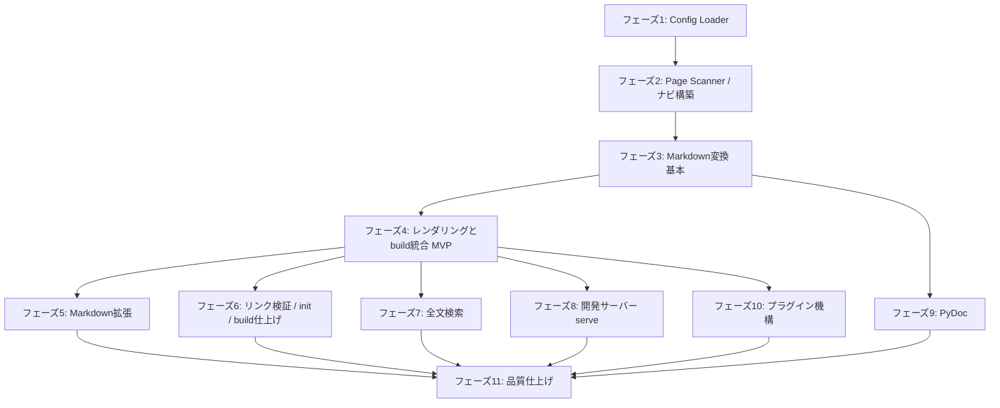

# MkDocsGen 開発ロードマップ

[concept-plan.md](../concept-plan.md) の仕様を、依存関係の順に機能単位で実装していくためのロードマップ。
各フェーズは「そのフェーズを終えると動作確認できる成果物が増える」ことを基準に区切っている。
すべてのフェーズで TDD（テストファースト）を必須とし、完了条件には必ずテストの充足を含める。

## フェーズ間の依存関係

フェーズ5以降は4（MVP）を土台に比較的独立しているため、必要に応じて順序を入れ替えたり並行で進めたりできる。

---

## フェーズ1: Config Loader（設定基盤）

**目的**: `mkdocsgen.yml` を読み込み、zodで検証済みの `ResolvedConfig` を得られるようにする。以降の全モジュールの入力となる土台。

**実装内容**

- [ ] zodによる設定スキーマ定義（`site` / `docs_dir` / `output_dir` / `nav` / `exclude` / `theme` / `pydoc` / `plugins` / `serve` / `markdown.allow_html`）
- [ ] デフォルト値の適用と正規化（`ResolvedConfig` 型の確定）
- [ ] YAML読み込みとエラーハンドリング
  - 設定ファイルが存在しない → `init` 実行を促すメッセージ付きエラー
  - YAML構文エラー → 行番号付きエラー
  - スキーマ違反 → 該当キーと期待される型を表示
- [ ] ロガー実装（`info` / `warn` / `error` + `--verbose` 時の `debug`）

**完了条件**: 正常読込・構文エラー・スキーマ違反・デフォルト値適用の単体テストがすべて通る（仕様書7.1 Config Loader観点）。

---

## フェーズ2: Page Scanner / ナビゲーション構築

**目的**: `docs/` 配下の走査からナビゲーションツリー・ページ一覧（メタ情報のみ）を構築できるようにする。

**実装内容**

- [ ] `.md` ファイル走査と `exclude`（glob）適用
- [ ] フロントマター解析（`title` / `order` / `description` / `draft`）
- [ ] タイトル決定の優先順位（frontmatter → 先頭見出し → ファイル名）
- [ ] 並び順の決定（`order` → 辞書順、`index.md` は常に先頭）
- [ ] セクション名の決定（`index.md` の title → ディレクトリ名）
- [ ] `draft: true` の除外
- [ ] `nav` 設定によるハイブリッド上書き（列挙分が優先、未列挙分は自動で末尾）
- [ ] `nav` の存在しないパス指定をビルドエラーにする
- [ ] `prev` / `next` / `breadcrumbs` の算出

**完了条件**: 仕様書7.1 Page Scanner観点・ナビゲーション観点の単体テストがすべて通る（代表例: `docs/a.md, docs/b/index.md, docs/b/c.md` → `a, b(c)` 構造）。

---

## フェーズ3: Markdown変換（基本）

**目的**: 1つのMarkdownソースをHTML断片・見出し一覧・プレーンテキストに変換できるようにする。

**実装内容**

- [x] markdown-it によるGFM変換（テーブル・タスクリスト・打ち消し線・自動リンク）
- [x] 見出しへのアンカーID付与と `headings`（ページ内目次用データ）の抽出
- [x] 内部リンクの書き換え（`.md` → `.html`、アンカー付きリンク対応）
- [x] 検索用プレーンテキスト抽出（HTMLタグ除去）
- [x] `markdown.allow_html: false` 時の生HTML無効化

**完了条件**: GFM各記法・リンク書き換え・アンカー生成の単体テストが通る。

---

## フェーズ4: レンダリングと build 統合（MVP）

**目的**: `mkdocsgen build` で実際に閲覧できる静的サイトが出力される、最初のエンドツーエンド動作を実現する。

**実装内容**

- [x] Nunjucks Renderer（`base.njk` / `page.njk` / `partials/` 一式の組み込みテーマ）
- [x] テンプレートコンテキスト変数（`site` / `page` / `nav` / `breadcrumbs` 等）の確定と文書化
- [x] `theme_overrides/` によるテンプレート解決順（オーバーライド優先）
- [x] 3カラムレイアウトのテーマCSS（CSS変数によるライト/ダークパレット）
- [x] テーマ切替トグル（light → dark → auto 循環、localStorage保存、FOUC防止のインラインスクリプト）
- [x] 左サイドバー（階層展開/折りたたみ、現在ページのハイライト）
- [x] 右サイドバー（ページ内目次、IntersectionObserverによる追従ハイライト）
- [x] パンくず・前後ページナビゲーション
- [x] buildコマンド統合（Config → Scan → 変換 → レンダリング → `site/` 出力）
- [x] `theme.custom_css` の注入
- [x] レスポンシブ対応（1200px / 768px ブレークポイント、モバイルドロワー）

**完了条件**: フィクスチャの `docs/` + `mkdocsgen.yml` からのフルビルド統合テスト（スナップショット比較）が通り、出力HTMLをブラウザで開いてレイアウト・テーマ切替が目視確認できる。テンプレートオーバーライドのテスト（`footer.njk` 差し替えでフッターのみ変わる）が通る。

---

## フェーズ5: Markdown拡張（Admonition / Shiki / Mermaid）

**目的**: ドキュメントの表現力を仕様書のフルセットまで引き上げる。

**実装内容**

- [x] Admonition記法（`::: note` 等、5タイプ + タイトル任意 + 未知タイプは警告付きで `note` 描画）
- [x] Shikiによるビルド時シンタックスハイライト（dual theme出力、言語指定なしはプレーンテキスト）
- [x] コードブロックのコピーボタン（クリップボードコピー + 「Copied」表示）
- [x] Mermaid対応（`<pre class="mermaid">` 出力 + クライアントサイド描画 + テーマ切替時の再描画）
- [x] Admonition内コードブロックとdual themeの組み合わせを目視確認（仕様書8.3の懸念事項）

**完了条件**: Admonition全タイプ・Shiki dual theme・Mermaid出力の単体テストが通り、実ビルドでの描画を目視確認済み。

---

## フェーズ6: リンク検証 / init / build 仕上げ

**目的**: `build` コマンドを仕様書のフルスペック（検証・オプション・雛形生成）に到達させる。

**実装内容**

- [x] 内部リンク検証（相対リンク・アンカーの存在チェック、切れリンクの一覧警告）
- [x] `--strict` オプション（警告をエラー化し終了コード1）
- [x] `--clean` オプション（出力ディレクトリの事前クリア）
- [x] `init` コマンド（`mkdocsgen.yml` / `docs/index.md` / `docs/guide/getting-started.md` の雛形生成、既存ファイルはスキップ + 警告）
- [x] ビルドサマリ表示（ページ数・警告数・所要時間）

**完了条件**: リンク検証観点の単体テスト（正常・切れ・アンカー・strict失敗）が通り、`init` → `build` → ブラウザ確認の一連の流れが新規ディレクトリで動作する。

---

## フェーズ7: 全文検索

**目的**: 生成サイト上でクライアントサイド全文検索を使えるようにする。

**実装内容**

- [x] 検索インデックス生成（タイトル・見出し・本文テキスト、bigramトークン化、`search-index.json` 出力）
- [x] MiniSearchによるクライアントサイド検索（初回フォーカス時の遅延ロード）
- [x] 検索UI（インクリメンタル検索、ドロップダウン結果表示、0件メッセージ、Enter/クリック/Escの操作、`/` キーショートカット）

**完了条件**: インデックス生成の単体テスト（テキスト抽出・bigram・JSON形式）が通り、日本語・英語ドキュメントでの検索を実ビルドで目視確認済み。

---

## フェーズ8: 開発サーバー（serve）

**目的**: 編集 → 即時プレビューの開発体験を提供する。

**実装内容**

- [x] HTTPサーバー（localhostバインドのみ、`--port` 対応）
- [x] chokidarによる監視（`docs/` / `mkdocsgen.yml` / テーマオーバーライド / pydoc対象ソース）
- [x] WebSocketによるライブリロード
- [x] 増分再ビルド（変更ページのみ再変換、nav影響時の範囲判定は仕様書8.3の懸念に留意）
- [x] 設定ファイル変更時のフルビルド
- [x] ビルドエラー時のエラーオーバーレイ表示と自動復帰

**完了条件**: HTTPレスポンス確認レベルの結合テストが通り、ファイル編集 → 1秒以内のリロードを目視確認済み。

---

## フェーズ9: PyDoc（Python APIドキュメント生成）

**目的**: `::: pydoc` ディレクティブでPythonのAPIドキュメントをページに展開できるようにする。

**実装内容**

- [ ] web-tree-sitter + tree-sitter-python.wasm のロード基盤と性能検証（100ページ規模で10秒以内の要件に収まるか初期に確認）
- [ ] Pythonソースの静的解析（モジュール / クラス / 関数 / メソッド / デコレーター / 型アノテーション / デフォルト値）
- [ ] Googleスタイルdocstring解析（`Args` / `Returns` / `Yields` / `Raises` / `Examples` / `Note` / `Warning`、不正形式はプレーンテキスト許容）
- [ ] モジュール解決（`pydoc.source_dirs` 起点、失敗時は探索パス一覧付きエラー）
- [ ] ディレクティブ展開（`members` / `show-private` / `heading-level` オプション、アンカーID付与、シグネチャ表示）
- [ ] Python構文エラー時の警告スキップ + ページ上へのエラー表示（`--strict` 時はエラー終了）

**完了条件**: 仕様書7.1のPyDoc Parser・docstring解析・pydocディレクティブ観点の単体テストが通り、フィクスチャPythonソースがHTML化される統合テストが通る。

---

## フェーズ10: プラグイン機構

**目的**: ビルドライフサイクルへ外部処理を差し込めるようにし、Confluenceエクスポートの参考実装を提供する。

**実装内容**

- [ ] プラグインローダー（ローカルESMファイルの読み込み、`PluginFactory` への `options` 受け渡し）
- [ ] ライフサイクルフック実行（`configResolved` / `transformMarkdown` / `transformHtml` / `buildEnd`、列挙順の直列実行）
- [ ] フック内例外のハンドリング（プラグイン名 + スタックトレース付きエラー終了）
- [ ] Confluenceエクスポート参考実装（`examples/plugins/confluence-export.mjs`、認証情報は環境変数、コアのテスト対象外）

**完了条件**: フック呼び出し順・options受け渡し・例外伝播の単体テストが通り、`transformHtml` の返り値が最終出力へ反映される統合テストが通る。

---

## フェーズ11: 品質仕上げ・非機能要件

**目的**: 非機能要件を満たし、日常利用に耐える品質へ引き上げる。

**実装内容**

- [ ] パフォーマンス計測（100ページ規模でクリーンビルド10秒以内、増分ビルド1秒以内）とボトルネック改善
- [ ] アクセシビリティ対応の総点検（キーボード操作、aria属性、WCAG AAコントラスト）
- [ ] JS無効環境での本文閲覧確認
- [ ] エラーハンドリング表（仕様書2.8）の全ケース網羅テスト
- [ ] MkDocsGen自身のドキュメントをMkDocsGenでビルドするドッグフーディング
- [ ] READMEと利用ドキュメントの整備（テンプレートコンテキスト変数の公開仕様化を含む）

**完了条件**: 非機能要件（仕様書5章）の各項目を計測・確認済みで、自分自身のドキュメントサイトがビルドできる。

---

## スコープ外（今回のロードマップに含めない）

仕様書8.2の今後の拡張予定（バージョン切替 / i18n / npmプラグイン配布 / NumPy・reSTスタイルdocstring / テーマ完全差し替え等）は本ロードマップの対象外とする。
