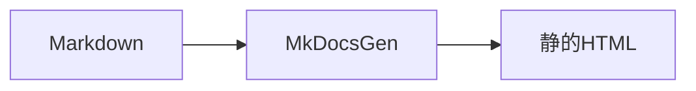

# Markdown拡張

GFM に加え、Admonition・シンタックスハイライト・Mermaid をサポートします。

## Admonition

次のように書きます。

::: tip
Admonition の中にもコードブロックを書けます。
:::

利用可能なタイプ: `note` / `tip` / `info` / `warning` / `danger`。未知のタイプは警告付きで `note` として描画されます。

記法の例:

````markdown
::: note 任意タイトル
本文です。
:::
````

## コードブロック（Shiki）

言語を指定するとビルド時にハイライトされます（ライト/ダーク両テーマ）。

```typescript
export function greet(name: string): string {
  return `Hello, ${name}`;
}
```

言語なしはプレーンテキストです。コードブロックにはコピーボタンが付きます。

## Mermaid

言語を `mermaid` にしたフェンスはクライアント側で図になります。



記法の例:

````markdown

````

JS が無効な環境ではソーステキストが `pre.mermaid` のまま残ります。

## 生HTML

既定では生HTMLを許可します。無効化する場合:

```yaml
markdown:
  allow_html: false
```
