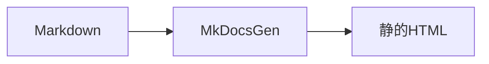

GFM に加え、Admonition・シンタックスハイライト・Mermaid・toctree をサポートします。

## Admonition

次のように書きます。

::: tip
Admonition の中にもコードブロックを書けます。
:::

利用可能なタイプ: `note` / `tip` / `info` / `warning` / `danger`。未知のタイプは警告付きで `note` として描画されます。

記法の例:

````markdown
::: note 任意タイトル
本文です。
:::
````

## toctree

Sphinx 風に、現在ページ配下の子ページを本文中へ自動列挙します。`maxdepth` を指定すると、子ページ内の見出し階層まで掘ります。

```markdown
::: toctree
maxdepth: 2
caption: このセクション
:::
```

| オプション | 既定 | 内容 |
| --- | --- | --- |
| `maxdepth` | 無制限 | `1` なら直下ページタイトルのみ。`2` 以上で子の見出しやさらに深いナビを含める |
| `caption` | なし | 一覧の上に出すタイトル |
| `titlesonly` | `false` | `true` ならページ／セクションタイトルのみ（見出しを出さない） |

列挙対象はナビツリーから決まります。

- セクションの `index.md` … その配下の子ページ／サブセクション
- サイト直下の `index.md` … ルート直下の他セクション／ページ
- 葉ページ（子なし）… 警告を出し、一覧は出さない

ページ自身の見出し TOC はサイドバーに既にあるため、toctree には含まれません。

## コードブロック（Shiki）

言語を指定するとビルド時にハイライトされます（ライト/ダーク両テーマ）。

```typescript
export function greet(name: string): string {
  return `Hello, ${name}`;
}
```

言語なしはプレーンテキストです。コードブロックにはコピーボタンが付きます。

## Mermaid

言語を `mermaid` にしたフェンスはクライアント側で図になります。



記法の例:

````markdown

````

JS が無効な環境ではソーステキストが `pre.mermaid` のまま残ります。

## 改行

段落内の通常改行はそのまま `<br>` として表示されます（末尾2スペースは不要）。CommonMark どおり改行を連結したい場合:

```yaml
markdown:
  breaks: false
```

空行は従来どおり段落の区切りです。

## 生HTML

既定では生HTMLを許可します。無効化する場合:

```yaml
markdown:
  allow_html: false
```
