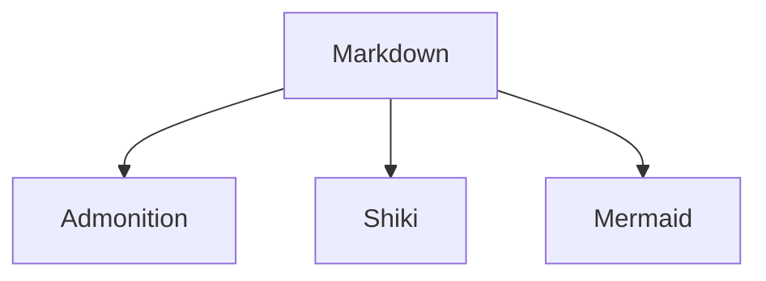

# Markdown Extensions Demo

## Admonition

::: note
通常の注記。**太字**も使えます。
:::

::: tip 便利なヒント
タイトル付きの tip です。
:::

::: warning
注意が必要な内容です。
:::

::: danger
危険な操作の説明です。
:::

::: info
補足情報です。
:::

## Admonition内コード（dual theme確認）

::: note コード付き注記
内側のコードブロックもハイライトされます。

```ts
function greet(name: string): string {
  return `Hello, ${name}!`;
}
```
:::

## コードブロック

```ts
const answer: number = 42;
console.log(answer);
```

言語指定なし:

```
plain text block
```

## Mermaid


